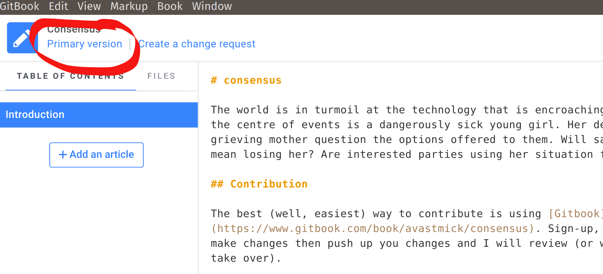
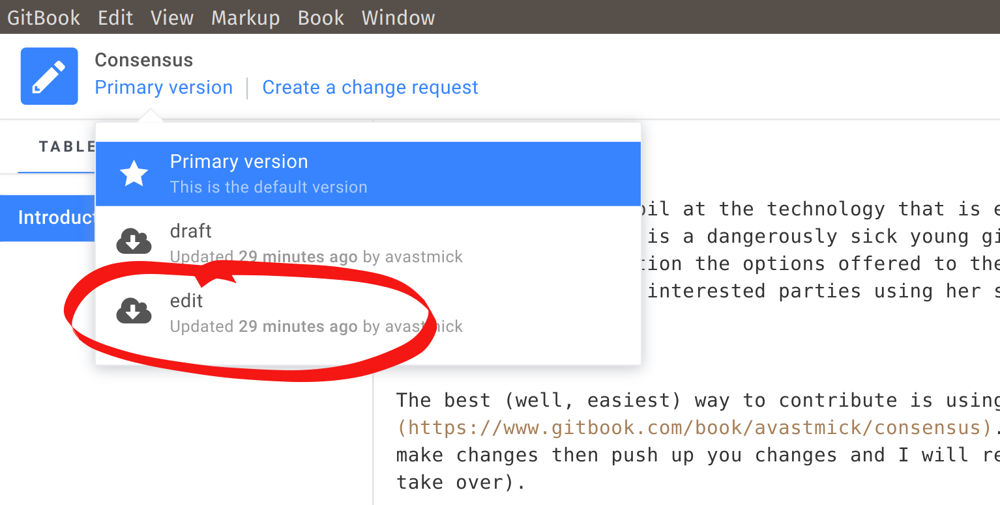
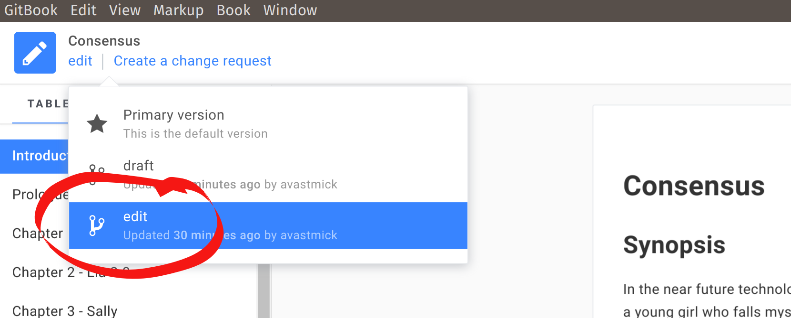

# Contributing

The best way to contribute will be to use [Gitbook](https://www.gitbook.com/book/avastmick/consensus). 

But, right now, the _easiest_ option is still highly technical - I'm working on it, but it is a limitation of the various editing platforms that exist for books.

## TL;DR;

- *Easy* - be technical!
- *Hard* - use `Gitbook`:
  - Sign-up, using whichever method you prefer
  - Create your own version of `Consensus`
  - Download the `Gitbook` editor
  - Make changes then push up you changes and I will review.

The problem is that the book is hosted on `Github.com`. I do this so I can easily control the versions of the chapters and merge in easily. From there I can automatically create eBook and PDF versions. **But,** this is rather more involved than the average person can manage. `Gitbook.com` comes close, but it still expects you to have a `Github.com` account, if you are going to collaborate...

## Step-by-step for `Gitbook.com`

**A work in progress!**

_Note:_ This README is on the `master` branch and is for information only. All changes should be made on the `edit` branch, with pull requests (for updates) to go into the `draft` branch.

- Go to [gitbook.com](https://gitbook.com)
- Sign-up, using whichever method you prefer
- Create your copy of `Consensus`
  - Click "+ New"...
  - On the "Create a new book" screen, click the down arrow:

*Some other stuff here about setting up a `Github.com` account and linking to your `Gitbook.com` account (argh!)*

- Wait until your book is ready (can take some time)
- Click "Edit"...
- Now select the working version - `edit`




- Enter Enter "https://github.com/avastmick/consensus" in box (again)
- Wait... until the version is `edit`



You will now be able to see all of the current chapters and can edit any that you like.

### Sending in your changes

- Submit a "Pull Request"
- *TODO:!*

### Technical Folks

If you are more technical, please use a typical git workflow. Only do this if you _are_ technical and know what `git` is _and_ know how to use it, otherwise go with the easier option above ;)

```bash
# Fork the https://github.com/avastmick/consensus repo
git clone https://github.com/[your_username]/consensus.git
cd consensus
git checkout edit
# make changes
git commit -am 'Made some changes'
git push
# Create pull request [your_username]/consensus/edit -> avastmick/consensus/edit
# Rinse and repeat
```