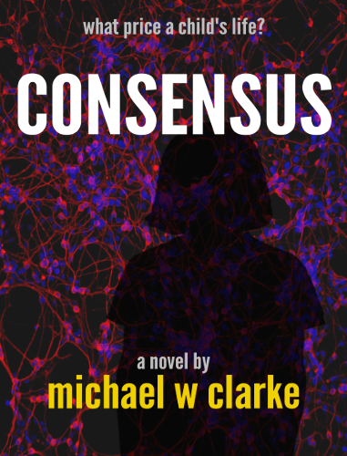

# consensus 

 
:book:

The world is in turmoil at the technology that is encroaching upon our biology. At the centre of events is a dangerously sick young girl. Her despairing grandfather and grieving mother question the options offered to them. Will saving her life in fact mean losing her? Are interested parties using her situation for their own ends?

